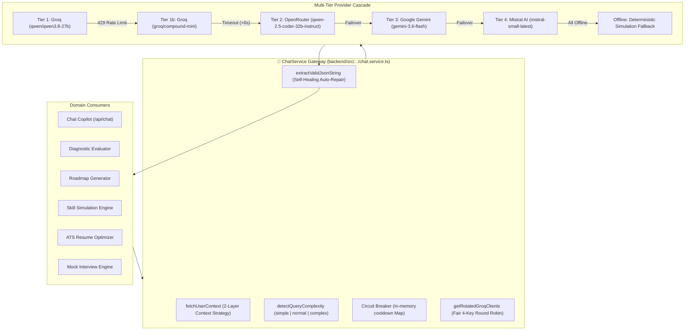

# AI Architecture: Multi-Tier Gateway & Inference Engineering

> **Document Status**: Reconstructed from the implemented system.  
> **Target System**: AI Pather (Repository: `Ai-learning-roadmap`)  
> **Primary Gateway Class**: `ChatService` in [`backend/src/modules/learner/copilot/services/chat.service.ts`](file:///c:/Coding-Projects/projects/Ai-learning-roadmap/backend/src/modules/learner/copilot/services/chat.service.ts)

---

## 1. Unified Gateway Architecture

AI Pather routes all platform AI operations—conversational copilot, diagnostic generation, roadmap curriculum design, 4-stage simulation synthesis, project build specifications, ATS resume rewriting, and mock interviews—through a single, highly resilient gateway class: `ChatService`.



---

## 2. Configured Models vs Documented Claims

A key finding from static code analysis is a divergence between marketing claims in [`README.md`](file:///c:/Coding-Projects/projects/Ai-learning-roadmap/README.md#L30) and the actual active code constants in [`chat.service.ts:L45-L61`](file:///c:/Coding-Projects/projects/Ai-learning-roadmap/backend/src/modules/learner/copilot/services/chat.service.ts#L45-L61):

| Provider Tier | README Claimed Model | Verified Implemented Model Constant | Evidence in Codebase |
| :--- | :--- | :--- | :--- |
| **Tier 1 (Groq Simple)** | `openai/gpt-oss-120b` | `qwen/qwen3.8-27b` | `chat.service.ts:L45` |
| **Tier 1 (Groq Complex)** | `openai/gpt-oss-120b` | `qwen/qwen3.8-27b` | `chat.service.ts:L46` |
| **Tier 1b (Groq Fallback)** | `openai/gpt-oss-20b` | `groq/compound-mini` | `chat.service.ts:L47` |
| **Tier 2 (OpenRouter)** | `qwen-2.5-coder-32b` | `qwen/qwen-2.5-coder-32b-instruct` | `chat.service.ts:L50` |
| **Tier 2b (OpenRouter Fallback)** | N/A | `qwen/qwen-2.5-72b-instruct`, `meta-llama/llama-3.1-8b-instruct` | `chat.service.ts:L51-L52` |
| **Tier 3 (Google Gemini)** | Gemini 2.5 Flash | `gemini-3.6-flash` | `chat.service.ts:L55` |
| **Tier 4 (Mistral AI)** | Mistral | `mistral-small-latest`, `open-mistral-7b` | `chat.service.ts:L59-L60` |

---

## 3. Two-Layer Context Strategy

To minimize database overhead and LLM input token consumption, `ChatService.fetchUserContext` implements a 2-layer strategy ([chat.service.ts:L318-L380](file:///c:/Coding-Projects/projects/Ai-learning-roadmap/backend/src/modules/learner/copilot/services/chat.service.ts#L318-L380)):

1. **Keyword Screening**: If the user's message does not contain career or learning keywords (e.g. casual greetings like "hello", "thank you"), context retrieval returns `undefined`, saving database queries.
2. **Layer A (Baseline Context)**: Executes a single lightweight query for `CareerProfile` (`targetRole`, `experienceLevel`, `weeklyAvailableHours`, `resumeScore`).
3. **Layer B (Conditional Deep Context)**: Triggered only for career inquiries. Executes three parallel queries (`Promise.all`) fetching active roadmap milestones, all user `SkillState` entries, and recent `Project` scores.

---

## 4. Self-Healing JSON Parser & Auto-Repair

LLMs frequently output invalid JSON by wrapping output in markdown code blocks (` ```json ... ``` `) or producing syntax errors like trailing commas. The function `extractValidJsonString` ([chat.service.ts:L257-L312](file:///c:/Coding-Projects/projects/Ai-learning-roadmap/backend/src/modules/learner/copilot/services/chat.service.ts#L257-L312)) executes a multi-step recovery process:
1. Strips leading and trailing markdown code block wrappers.
2. Locates the outermost opening and closing braces (`{ ... }` or `[ ... ]`).
3. Executes a test `JSON.parse`.
4. If parsing fails, applies automated regex repair:
   - Removes single-line comments: `.replace(/\/\/.*$/gm, "")`
   - Strips trailing commas before closing braces/brackets: `.replace(/,\s*([}\]])/g, "$1")`
5. Re-tests parsed JSON; returns repaired string or raw text if unrecoverable.
