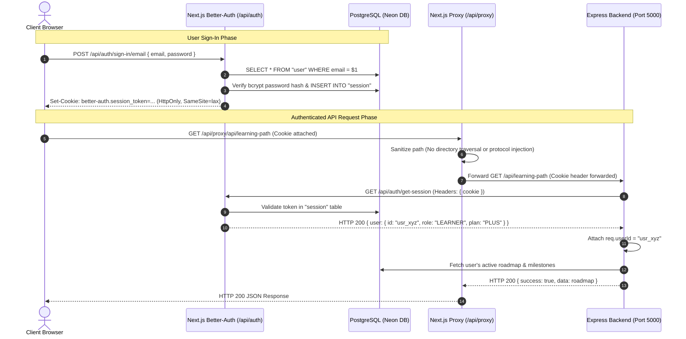

# API Authentication & Session Flow: AI Pather

> **Document Status**: Reconstructed from the implemented system.  
> **Target System**: AI Pather (Repository: `Ai-learning-roadmap`)  
> **Version Evaluated**: 1.0.0

---

## 1. Authentication Topology

Authentication in AI Pather operates across a dual-tier architecture:
- **Issuer / Identity Provider**: Better-Auth runs inside Next.js (`frontend/src/lib/auth.ts`) utilizing the PostgreSQL database directly via `pg.Pool`.
- **Consumer / Resource Server**: Express backend (`backend/src/app.ts`) validates sessions by executing HTTP loopback verification against Next.js.



---

## 2. Session Cookies & Attributes

Better-Auth manages cookies with explicit security attributes defined in [`frontend/src/lib/auth.ts:L517-L525`](file:///c:/Coding-Projects/projects/Ai-learning-roadmap/frontend/src/lib/auth.ts#L517-L525):

```typescript
advanced: {
  defaultCookieAttributes: {
    sameSite: "lax",
    secure:
      process.env.NODE_ENV === "production" &&
      !process.env.BETTER_AUTH_URL?.includes("localhost"),
    httpOnly: true,
  },
}
```

- **`httpOnly: true`**: Prevents JavaScript running in the browser (XSS attacks) from reading the session token.
- **`sameSite: "lax"`**: Protects against Cross-Site Request Forgery (CSRF) on top-level cross-site navigations while allowing normal user interactions.
- **`secure`**: Enforces HTTPS in production deployments.

---

## 3. Two-Factor Authentication (2FA) Lifecycle

1. **Enablement**: The user enables 2FA via Better-Auth's `twoFactor` plugin, creating a record in the `twoFactor` PostgreSQL table.
2. **First-Factor Verification**: User submits email/password. Better-Auth detects `twoFactorEnabled: true`, issues a temporary two-factor challenge token, and sends an email OTP using Nodemailer / Gmail SMTP.
3. **Second-Factor Verification**: User enters the 6-digit OTP in [`AuthOtpInput.tsx`](file:///c:/Coding-Projects/projects/Ai-learning-roadmap/frontend/src/components/auth/AuthOtpInput.tsx), invoking `/api/auth/two-factor/verify-otp`.
4. **Session Finalization**: Upon successful verification, the full signed session cookie is written.

---

## 4. Architectural Analysis & Vulnerability Observations

### Critical Finding 1: Loopback Session Fetch Latency
Because the Express backend delegates session verification via HTTP `fetch` to Next.js on every protected route:
- Every API call incurs an additional HTTP network round-trip.
- Under high concurrent user traffic, this creates a connection amplification bottleneck between Express, Next.js, and PostgreSQL.

### Critical Finding 2: Admin Middleware Bypasses Session Verification
As discovered in [`backend/src/middlewares/admin.middleware.ts:L21-L52`](file:///c:/Coding-Projects/projects/Ai-learning-roadmap/backend/src/middlewares/admin.middleware.ts#L21-L52):
- The `requireAdmin` middleware checks `req.query.userId || req.body.userId` without invoking `requireAuth`.
- If an attacker supplies an administrator's user ID via query parameter (`?userId=<admin_id>`), the middleware loads the admin user from PostgreSQL, verifies the `role === "ADMIN"`, and grants access without verifying the caller's session cookie.
