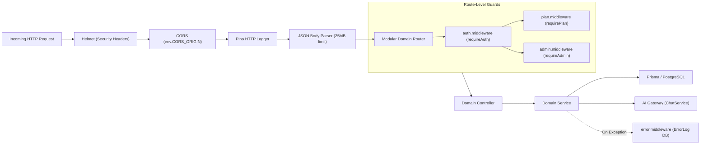

# Backend Architecture: AI Pather

> **Document Status**: Reconstructed from the implemented system.  
> **Target System**: AI Pather (Repository: `Ai-learning-roadmap/backend`)  
> **Version Evaluated**: 1.0.0

---

## 1. Modular Monolithic Structure

The backend is architected as an Express 5 TypeScript service utilizing a modular domain layout. Each domain module encapsulates its own routing, controllers, services, schemas, and tests.

```
backend/src/
├── config/
│   └── env.ts                          # Zod-validated environment schema & defaults
├── lib/
│   ├── logger.ts                       # Structured Pino logger
│   └── prisma.ts                       # Prisma client instance with @prisma/adapter-pg & custom pool
├── middlewares/
│   ├── admin.middleware.ts             # Admin role authorization (requireAdmin)
│   ├── auth.middleware.ts              # Session verification (requireAuth & optionalAuth)
│   ├── error.middleware.ts             # Central error handler & ErrorLog DB persistence
│   ├── not-found.middleware.ts         # 404 handler for unknown routes
│   └── plan.middleware.ts              # Subscription paywall guard (requirePlan)
│
├── modules/
│   ├── admin/                          # 21 Administrative domain modules
│   │   ├── activity/                   # Global user activity logs
│   │   ├── ai-sandbox/                 # Multi-model prompt playground
│   │   ├── ai-usage/                   # Provider token & latency logs
│   │   ├── analytics/                  # Daily platform metrics & data exports
│   │   ├── assessments/                # Administrative simulation oversight
│   │   ├── audit-logs/                 # Admin action audit trail
│   │   ├── broadcast/                  # System announcements
│   │   ├── dashboard/                  # Aggregated administrative overview
│   │   ├── error-logs/                 # Production exception inspection
│   │   ├── system-health/              # Provider uptime & database health
│   │   └── users/                      # User management & role modification
│   │
│   └── learner/                        # 22 Learner domain modules
│       ├── application-readiness/      # Readiness calculation & status categories
│       ├── assessments/                # 4-stage skill simulations & deterministic fallback
│       ├── career-alignment/           # Role skill requirements & taxonomy
│       ├── career-intelligence/        # Progression decision engine
│       ├── career-twin/                # Senior benchmark comparison
│       ├── copilot/                    # Multi-tier AI Gateway & chat service
│       ├── dashboard/                  # Learner dashboard summary & metrics
│       ├── diagnostic/                 # Question bank & baseline evaluation
│       ├── gamification/               # XP ledger & achievement rewards
│       ├── interview/                  # AI technical mock interview engine
│       ├── job-reality/                # Job market scraper & classifier
│       ├── notifications/              # Real-time learner alerts & notifications
│       ├── profile/                    # Career profile & onboarding state
│       ├── progress/                   # XP history & milestone progress tracking
│       ├── projects/                   # Project Studio & GitHub Inspector
│       ├── proof-graph/                # Verifiable dependency graph & HMAC tokens
│       ├── readiness/                  # 4-pillar readiness calculation
│       ├── resume/                     # AI Resume builder & ATS analysis
│       ├── roadmap/                    # Dynamic prerequisite graph generator
│       ├── settings/                   # Account settings & credentials
│       ├── skill-gaps/                 # Skill state tracking & debt calculation
│       └── subscription/               # Plan status & sync
│
├── app.ts                              # Express application mounting all routes
└── server.ts                           # HTTP server listener entry point
```

---

## 2. Middleware & Execution Pipeline

Incoming HTTP requests traverse the following pipeline in [`backend/src/app.ts`](file:///c:/Coding-Projects/projects/Ai-learning-roadmap/backend/src/app.ts):



### Route-Level Guards:
1. **`requireAuth`**: Extracts session cookie, queries Next.js Better-Auth endpoint (`${FRONTEND_URL}/api/auth/get-session`), and sets `req.userId`.
2. **`optionalAuth`**: Extracts session cookie if present; continues without error if absent.
3. **`requirePlan(["PLUS", "PRO"])`**: Verifies user's active plan in PostgreSQL (`user.plan`); `ADMIN` users automatically bypass plan restrictions.
4. **`requireAdmin`**: Inspects user's role in PostgreSQL to enforce administrative access.

---

## 3. Database Layer & Connection Pool Strategy

To prevent idle connection drops when operating with cloud-hosted PostgreSQL instances (such as Neon Serverless), the backend implements a resilient database adapter in [`backend/src/lib/prisma.ts`](file:///c:/Coding-Projects/projects/Ai-learning-roadmap/backend/src/lib/prisma.ts):
- Utilizes `pg.Pool` with `max: 10` connections.
- Sets `idleTimeoutMillis: 10000` (10 seconds) so the pool closes idle connections before the cloud serverless load balancer drops them.
- Implements `pool.on("error", ...)` to prevent uncaught node-postgres exceptions from terminating the Express server.
- Integrates with Prisma via `@prisma/adapter-pg`.
