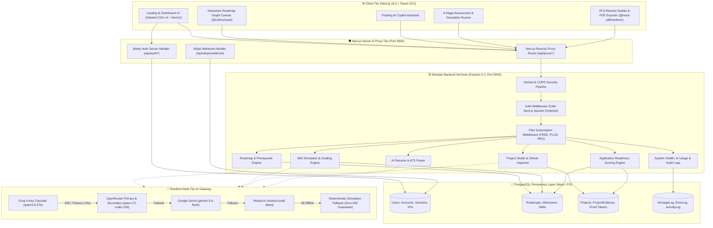
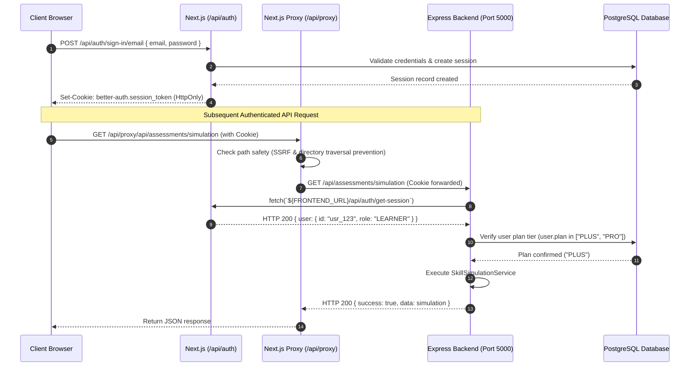
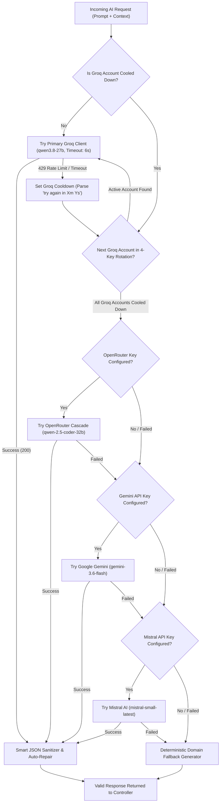

# Architecture Diagrams: AI Pather

> **Document Status**: Reconstructed from the implemented system.  
> **Target System**: AI Pather (Repository: `Ai-learning-roadmap`)  
> **Version Evaluated**: 1.0.0

---

## 1. End-to-End System Topology

---

## 2. Authentication & Session Verification Flow

---

## 3. Four-Tier AI Failover & Cooldown Pipeline

