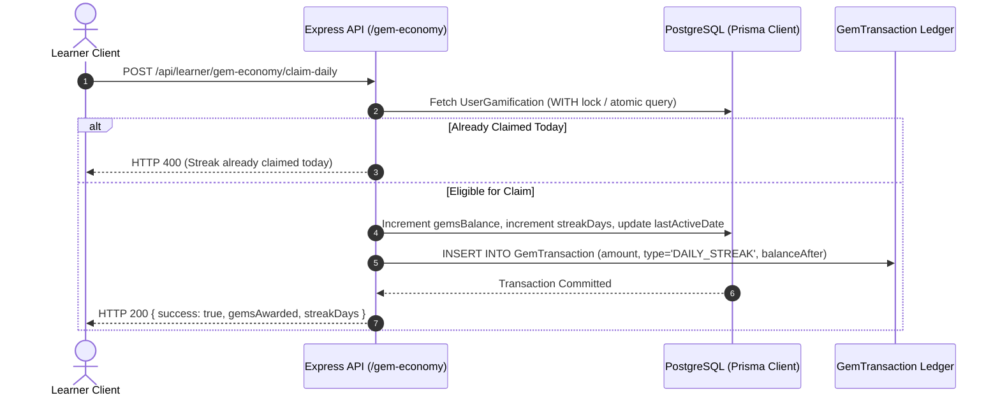

# Gem Economy, Atomic Ledger & Adaptive Recovery Architecture

> **Document Status**: Production Architecture Reference  
> **Target System**: AI Pather (`backend/src/modules/learner/gem-economy`, `backend/src/modules/admin/gem-economy`, `backend/src/modules/learner/adaptive-recovery`)  
> **Database Models**: `UserGamification`, `GemTransaction` (Prisma ORM 7.9.1 on PostgreSQL 16)  

---

## 1. Overview & Architectural Goals

The **Gem Economy & Adaptive Recovery System** transforms passive curriculum tracking into an engaging, proof-backed retention engine designed for enterprise scale (100,000+ active learners):

1. **Incentivized Daily Engagement**: Daily streaks award escalating gem dividends (1, 2, 5 gems) without creating inflation.
2. **Immutable Atomic Ledger**: Every gem mutation (credit, debit, gift, penalty) creates an audited `GemTransaction` entry with the cryptographic post-transaction balance.
3. **Zero-Guilt Comeback Architecture**: Rather than resetting learner streaks or progress when absent for 7+ days, the system offers a non-punitive 4-day micro catch-up plan to rebuild cognitive momentum.
4. **Roadmap Velocity Simulator**: Empowers learners to calibrate their weekly commitment (3-40 hrs/week) with dynamic target date projection.
5. **Strict Admin Treasury Controls**: Complete transparency for platform administrators with real-time treasury analytics, learner drop-off telemetry, and audited manual adjustments.

---

## 2. Streak Ladder & Gem Minting Mechanics

### Welcome Balance
Upon initial registration or wallet initialization, learners receive a default **10 Gems** welcome grant (`WELCOME_BONUS`).

### Daily Streak Reward Ladder
Streak rewards are evaluated dynamically per calendar day:
$$\text{Reward}(\text{streakDays}) = \begin{cases} 
5 \text{ Gems}, & \text{if } \text{streakDays} \ge 7 \\ 
2 \text{ Gems}, & \text{if } \text{streakDays} \ge 3 \\ 
1 \text{ Gem}, & \text{otherwise} 
\end{cases}$$

### Milestone Completion Rewards
Completing major roadmap milestones awards between **5 and 15 Gems** depending on milestone complexity, logged atomically under `MILESTONE_REWARD`.

---

## 3. Atomic Balance Ledger Architecture

All balance adjustments execute inside an atomic transaction to ensure zero race conditions and zero phantom balances:



---

## 4. Enterprise 100k Learner Scale Optimizations

For platforms serving 100,000+ registered learners, standard ORM in-memory counts or unrestricted table scans cause severe latency. The Gem Economy implements the following database optimizations:

1. **PostgreSQL Raw Aggregation**:
   ```sql
   SELECT 
     COALESCE(SUM("gemsBalance"), 0)::BIGINT AS "totalGemsDistributed",
     COUNT(DISTINCT "userId") FILTER (WHERE "streakDays" > 0)::INT AS "activeStreaksCount"
   FROM "UserGamification";
   ```
2. **Negative-Relation Inactivity Filtering**:
   Detecting learners who have not logged activity in 7+ days is executed using Prisma's indexed subquery:
   ```typescript
   const atRiskLearners = await prisma.user.findMany({
     where: {
       role: 'LEARNER',
       activityLogs: {
         none: {
           createdAt: { gte: sevenDaysAgo }
         }
       }
     },
     take: 20
   });
   ```
3. **Compound Ledger Index**:
   `@@index([userId, createdAt(sort: Desc)])` guarantees sub-10ms paginated retrieval for individual and administrative audits.

---

## 5. Zero-Guilt Adaptive Recovery & Velocity Simulator

### Non-Punitive Inactivity Interception
Learners who experience life disruptions are not penalized. The system:
- Retains their completed milestones and skill proficiencies without resetting.
- Generates a 4-day micro plan (15-20 min daily goals) covering missing prerequisite concepts.
- Awards a recovery bonus upon completion of the 4-day plan.

### Roadmap Velocity Simulator
Learners can simulate their roadmap completion date via an interactive slider:
$$\text{Weeks Remaining} = \max\left(1, \left\lceil \frac{\text{Remaining Estimated Hours}}{\text{Weekly Available Hours}} \right\rceil\right)$$
$$\text{Projected Completion Date} = \text{Current Date} + (\text{Weeks Remaining} \times 7 \text{ days})$$

---

## 6. Strict Role-Based URL Security (403 Forbidden Screen)

To protect administrative routes (`/dashboard/admin/*`) from unauthorized learner exploration:
- **Server Middleware**: `requireAdmin` validates role from Better-Auth session tokens and rejects non-admin users with HTTP 403.
- **Client Security Guard (`AdminGuard.tsx`)**: Replaces the dashboard layout with an unskippable 403 Forbidden alert screen featuring:
  - Access Denied security badge.
  - Active user identity and role indicator (`ROLE: LEARNER`).
  - Automatic 5-second countdown redirect to `/dashboard/learner`.
  - Immediate "Return to Dashboard" and "Sign Out" navigation actions.
