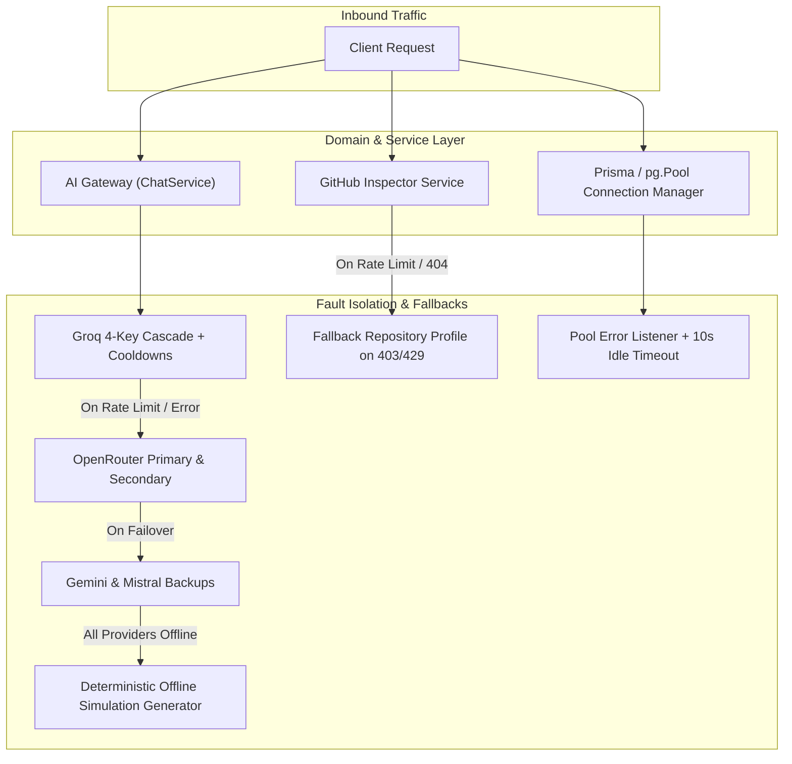

# Architecture: Reliability Engineering & Failure Recovery

> **Document Status**: Reconstructed from the implemented AI Pather system.  
> **Target System**: AI Pather (Repository: `Ai-learning-roadmap`)  
> **Focus**: Fault Tolerance, Cascades, Retry Logic, and High Availability

---

## 1. Reliability Architecture Overview

AI Pather implements fault isolation across its major external dependencies:

---

## 2. Failure Handling by Subsystem

### A. AI Provider Failure & Rate Limits (HTTP 429 / Timeouts)
- **Mechanisms Implemented**:
  1. *Multi-Account Cascade*: Groq requests rotate across up to 4 accounts (`getRotatedGroqClients`).
  2. *Automatic Cooldown (Circuit Breaker)*: Models hitting rate limits parse the retry window (`try again in Xm Ys`) and pause calls for that duration plus a 1,500ms safety buffer. Cooled-down models are bypassed without initiating network requests.
  3. *Cross-Provider Fallback*: When Groq is exhausted, the cascade falls back sequentially through OpenRouter (`qwen-2.5-coder-32b-instruct`), Google Gemini (`gemini-3.6-flash`), and Mistral AI (`mistral-small-latest`).
  4. *Deterministic Zero-500 Fallback*: In `SkillSimulationService`, if all external LLMs fail or timeout, the engine serves a calibrated, schema-valid offline simulation with zero HTTP 500 errors ([skill-simulation.service.ts:L115](file:///c:/Coding-Projects/projects/Ai-learning-roadmap/backend/src/modules/learner/assessments/services/skill-simulation.service.ts#L115)).

### B. External API Failure (GitHub API)
- **Mechanisms Implemented**:
  1. *Timeout Guard*: GitHub API calls enforce a strict 7,000ms timeout via `AbortController` ([github-inspector.service.ts:L74](file:///c:/Coding-Projects/projects/Ai-learning-roadmap/backend/src/modules/learner/projects/services/github-inspector.service.ts#L74)).
  2. *Graceful Rate-Limit Degradation*: If GitHub returns HTTP 403 or 429 (unauthenticated rate limit reached), the inspector does not throw an exception; it returns an accessible fallback repository profile (`isAccessible: true`, `errorMessage: "GitHub API rate limit reached; basic repository profile created."`) ([github-inspector.service.ts:L85-L102](file:///c:/Coding-Projects/projects/Ai-learning-roadmap/backend/src/modules/learner/projects/services/github-inspector.service.ts#L85-L102)).

### C. Database Connection Failure (Neon Serverless PostgreSQL)
- **Mechanisms Implemented**:
  1. *Proactive Socket Pruning*: `idleTimeoutMillis: 10000` ensures that `pg.Pool` terminates idle sockets before Neon's serverless compute load balancer closes them.
  2. *Uncaught Exception Guard*: Attaches `pool.on("error", (err) => { console.error("Unexpected error on idle Prisma pool client:", err.message); })` ([prisma.ts:L31-L33](file:///c:/Coding-Projects/projects/Ai-learning-roadmap/backend/src/lib/prisma.ts#L31-L33)), preventing idle socket drops from crashing the Node.js process.

### D. JSON Deserialization & Parse Failure
- **Mechanisms Implemented**:
  1. *Smart Auto-Repair*: `extractValidJsonString` extracts outermost braces, strips markdown backtick wrappers, removes inline JavaScript comments (`//`), and regex-removes trailing commas before retrying `JSON.parse`.

---

## 3. Reliability Gaps & Risks

1. **In-Memory Circuit Breaker State**:
   - `modelCooldowns = new Map<string, number>()` resides in Node.js process memory. In a multi-replica deployment, cooldown states are not shared across containers.
2. **Missing Asynchronous Job Queues**:
   - Operations like repository inspection and ATS keyword extraction run synchronously within the HTTP thread. If a request stalls, the connection remains open until client or proxy timeout.
3. **No Automatic Database Failover**:
   - While serverless connection pooling is resilient, the system relies on a single database connection string (`DATABASE_URL`) without read-replica routing.
