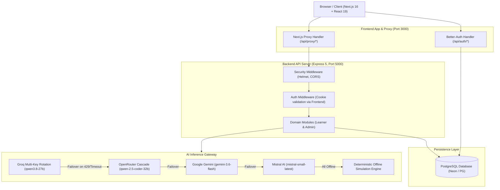

# System Architecture: AI Pather

> **Document Status**: Reconstructed from the implemented system.  
> **Target System**: AI Pather (Repository: `Ai-learning-roadmap`)  
> **Version Evaluated**: 1.0.0

---

## 1. High-Level Architectural Pattern

AI Pather is structured as a decoupled full-stack application operating within a unified repository:
- **Presentation & Web Client Layer**: Next.js 16.3.1 (React 19.2.8) with Tailwind CSS v4, HeroUI, and `@xyflow/react`.
- **API Proxy & Auth Host**: Next.js Route Handlers (`/api/auth/*` and `/api/proxy/*`) managing Better-Auth cookies and reverse-proxying API traffic to the backend.
- **Domain API & Core Business Services**: Node.js / Express 5.2.1 modular monolithic API server managing business logic, scoring algorithms, and database transactions.
- **Data Persistence Layer**: PostgreSQL relational database managed via Prisma ORM 7.9.1 with `@prisma/adapter-pg` and custom pooling for Neon serverless database resilience.
- **AI Gateway & Failover Engine**: Resilient multi-tier LLM gateway (`ChatService`) with multi-account rotation, regex-based circuit breaking, and deterministic zero-500 fallbacks.

---

## 2. Request Lifecycle & Communication Topology

### A. Client-to-Backend Request Flow
1. **User Action**: The user initiates an action in the React client (e.g., submitting a simulation, generating a roadmap).
2. **API Client Execution**: The frontend client utility in [`frontend/src/lib/core/server.ts`](file:///c:/Coding-Projects/projects/Ai-learning-roadmap/frontend/src/lib/core/server.ts) formats the request, targeting `/api/proxy/<endpoint>`.
3. **Next.js Reverse Proxy**: [`frontend/src/app/api/proxy/[...path]/route.ts`](file:///c:/Coding-Projects/projects/Ai-learning-roadmap/frontend/src/app/api/proxy/[...path]/route.ts):
   - Validates the path against directory traversal (`..`, `\`) and protocol injection.
   - Forwards the incoming `Cookie` header containing Better-Auth session tokens.
   - Dispatches the request via HTTP `fetch` to the Express backend (`http://localhost:5000/<path>`).
4. **Express Middleware Pipeline**:
   - `helmet()` applies secure HTTP headers ([app.ts:L36](file:///c:/Coding-Projects/projects/Ai-learning-roadmap/backend/src/app.ts#L36)).
   - `cors()` verifies origin matches `env.CORS_ORIGIN` ([app.ts:L40](file:///c:/Coding-Projects/projects/Ai-learning-roadmap/backend/src/app.ts#L40)).
   - `pinoHttp()` captures structured telemetry in production ([app.ts:L48](file:///c:/Coding-Projects/projects/Ai-learning-roadmap/backend/src/app.ts#L48)).
   - Body parsers accept JSON payloads up to 25MB ([app.ts:L60](file:///c:/Coding-Projects/projects/Ai-learning-roadmap/backend/src/app.ts#L60)).
5. **Authentication Verification**:
   - `requireAuth` or `optionalAuth` extracts the cookie header and queries the Next.js auth endpoint:
     `fetch(`${NEXT_JS_URL}/api/auth/get-session`, { headers: { cookie } })` ([auth.middleware.ts:L26](file:///c:/Coding-Projects/projects/Ai-learning-roadmap/backend/src/middlewares/auth.middleware.ts#L26)).
   - Sets `req.userId = data.user.id`.
6. **Plan & Role Verification**:
   - `requirePlan(["PLUS", "PRO"])` inspects `user.plan` in PostgreSQL ([plan.middleware.ts:L18](file:///c:/Coding-Projects/projects/Ai-learning-roadmap/backend/src/middlewares/plan.middleware.ts#L18)).
   - `requireAdmin` verifies administrative privileges ([admin.middleware.ts:L15](file:///c:/Coding-Projects/projects/Ai-learning-roadmap/backend/src/middlewares/admin.middleware.ts#L15)).
7. **Controller & Domain Service Execution**:
   - Business logic runs within domain services (e.g., `SkillSimulationService`, `PortfolioService`, `LearningPathService`).
8. **Persistence & External AI**:
   - Relational data queries execute through `prisma.<entity>` queries using the connection pool.
   - AI generation requests route through `ChatService.processJsonCompletion` or `ChatService.processChat`.
9. **Response Serialization**:
   - The controller sends structured JSON (`{ success: true, data: ... }`).
   - The Next.js proxy forwards the status and response body back to the browser.
   - React Query updates local cache and UI state.

---

## 3. Technology Stack Inventory

| Layer | Technology | Exact Version | Configuration Evidence |
| :--- | :--- | :--- | :--- |
| **Frontend Framework** | Next.js (App Router) | `16.3.1` | [`frontend/package.json`](file:///c:/Coding-Projects/projects/Ai-learning-roadmap/frontend/package.json#L37) |
| **UI Library** | React | `19.2.8` | [`frontend/package.json`](file:///c:/Coding-Projects/projects/Ai-learning-roadmap/frontend/package.json#L43) |
| **Styling** | Tailwind CSS / PostCSS | `4.x` | [`frontend/package.json`](file:///c:/Coding-Projects/projects/Ai-learning-roadmap/frontend/package.json#L59) |
| **Graph Visualization** | `@xyflow/react` | `12.11.6` | [`frontend/package.json`](file:///c:/Coding-Projects/projects/Ai-learning-roadmap/frontend/package.json#L24) |
| **State & Data Fetching** | TanStack React Query | `5.102.8` | [`frontend/package.json`](file:///c:/Coding-Projects/projects/Ai-learning-roadmap/frontend/package.json#L19) |
| **PDF Generation** | `@react-pdf/renderer` | `4.9.0` | [`frontend/package.json`](file:///c:/Coding-Projects/projects/Ai-learning-roadmap/frontend/package.json#L17) |
| **Backend Server** | Express | `5.2.1` | [`backend/package.json`](file:///c:/Coding-Projects/projects/Ai-learning-roadmap/backend/package.json#L24) |
| **Database** | PostgreSQL (Neon / PG) | PostgreSQL 16 compatible | [`backend/src/lib/prisma.ts`](file:///c:/Coding-Projects/projects/Ai-learning-roadmap/backend/src/lib/prisma.ts#L21-L28) |
| **ORM** | Prisma | `7.9.1` | [`backend/package.json`](file:///c:/Coding-Projects/projects/Ai-learning-roadmap/backend/package.json#L20) |
| **Authentication** | Better-Auth | `1.7.1` (backend) / `1.7.2` (frontend) | [`frontend/src/lib/auth.ts`](file:///c:/Coding-Projects/projects/Ai-learning-roadmap/frontend/src/lib/auth.ts#L8) |
| **Primary AI Inference** | Groq SDK (`qwen3.8-27b`) | `1.5.0` | [`backend/package.json`](file:///c:/Coding-Projects/projects/Ai-learning-roadmap/backend/package.json#L26) |
| **Secondary AI Inference**| OpenRouter (Direct REST) | HTTP REST API | [`backend/src/modules/learner/copilot/services/chat.service.ts`](file:///c:/Coding-Projects/projects/Ai-learning-roadmap/backend/src/modules/learner/copilot/services/chat.service.ts#L201-L238) |
| **Tertiary AI Inference** | Google GenAI SDK | `2.18.0` | [`backend/package.json`](file:///c:/Coding-Projects/projects/Ai-learning-roadmap/backend/package.json#L15) |
| **Quaternary AI Inference**| Mistral AI SDK | `2.6.4` | [`backend/package.json`](file:///c:/Coding-Projects/projects/Ai-learning-roadmap/backend/package.json#L16) |
| **Validation** | Zod | `4.4.3` (backend) | [`backend/package.json`](file:///c:/Coding-Projects/projects/Ai-learning-roadmap/backend/package.json#L32) |
| **Logging** | Pino & Pino-HTTP | `10.3.1` / `11.0.0` | [`backend/package.json`](file:///c:/Coding-Projects/projects/Ai-learning-roadmap/backend/package.json#L29-L30) |
| **Payment** | Stripe SDK | `22.6.0` (frontend) | [`frontend/package.json`](file:///c:/Coding-Projects/projects/Ai-learning-roadmap/frontend/package.json#L50) |
