# Database Data Flow: AI Pather

> **Document Status**: Reconstructed from the implemented system.  
> **Target System**: AI Pather (Repository: `Ai-learning-roadmap`)  
> **Version Evaluated**: 1.0.0

---

## 1. End-to-End Learner Data Flow

```mermaid
flowchart TD
    subgraph OnboardingFlow ["1. Onboarding & Profiling"]
        Reg["User Registers via Better-Auth"] --> UserRow["INSERT INTO 'user' (role: 'LEARNER', plan: 'FREE')"]
        UserRow --> ProfileForm["User Completes Onboarding Form"]
        ProfileForm --> ProfileRow["INSERT INTO 'CareerProfile' (targetRole, hours)"]
    end

    subgraph DiagnosticFlow ["2. Diagnostic Baseline Assessment"]
        ProfileRow --> FetchQuestions["SELECT * FROM 'DiagnosticQuestion' WHERE isActive=true"]
        FetchQuestions --> SubmitAnswers["POST /api/diagnostic/submit"]
        SubmitAnswers --> AttemptRow["INSERT INTO 'DiagnosticAttempt' (status: 'COMPLETED', score)"]
        AttemptRow --> AnswerRows["INSERT INTO 'DiagnosticAnswer' (isCorrect, evaluation)"]
        AnswerRows --> InitSkillState["UPSERT INTO 'SkillState' (knowledgeScore, practiceScore)"]
    end

    subgraph RoadmapFlow ["3. Dynamic Roadmap Synthesis"]
        InitSkillState --> GenRoadmap["ChatService Synthesizes Milestones"]
        GenRoadmap --> RoadmapRow["INSERT INTO 'Roadmap' (status: 'ACTIVE')"]
        RoadmapRow --> MilestoneRows["INSERT INTO 'Milestone' (status: 'CURRENT' / 'UPCOMING')"]
    end

    subgraph SimulationFlow ["4. 4-Stage Simulation & Mastery Loop"]
        MilestoneRows --> SimStart["GET /api/assessments/simulation"]
        SimStart --> ActiveLog["INSERT INTO 'ActivityLog' (type: 'SKILL_SIMULATION_ACTIVE')"]
        ActiveLog --> SubmitSim["POST /api/assessments/simulation/submit"]
        SubmitSim --> UpdateSkills["UPDATE 'SkillState' (knowledgeScore, practiceScore)"]
        UpdateSkills --> UpdateMilestone["UPDATE 'Milestone' (status: 'COMPLETED')"]
    end

    subgraph ProjectEvidenceFlow ["5. Project Studio & Proof Graph"]
        UpdateMilestone --> ImportRepo["POST /api/portfolio/import (GitHub URL)"]
        ImportRepo --> Inspector["GitHub Inspector extracts files & tests"]
        Inspector --> ProjectRow["INSERT INTO 'Project' (isVerified, score)"]
        ProjectRow --> EvidenceRow["INSERT INTO 'ProjectEvidence' (skillName, evidenceType: 'GITHUB')"]
        EvidenceRow --> ProofQuery["GET /api/proof-graph (Aggregates skills, diags, projects)"]
        ProofQuery --> Token["generateProofGraphShareToken (HMAC-SHA256)"]
    end

    subgraph CareerReadinessFlow ["6. Career Twin & ATS Readiness"]
        EvidenceRow --> CalcReadiness["getCareerReadiness (Averages 7 Dimensions)"]
        CalcReadiness --> ReadyScore["Overall Score >= 70% ? Career Ready : In Progress"]
        ReadyScore --> ResumeBuild["POST /api/resume/analyze-ats"]
        ResumeBuild --> ResumeRow["UPSERT INTO 'Resume' (atsScore, atsFeedback)"]
    end
```



---

## 2. Key Mutational Lifecycle Transactions

### 1. Diagnostic Attempt Finalization
When a learner finishes a diagnostic test:
1. Answers are recorded in `DiagnosticAnswer`.
2. Total and correct answers are aggregated into `DiagnosticAttempt.score`.
3. Evaluated skills iterate through `prisma.skillState.upsert`, initializing baseline scores for each tested technology.
4. An `ActivityLog` record is written (`type: "ASSESSMENT"`).

### 2. Four-Stage Simulation Grading
When a simulation is submitted ([skill-simulation.service.ts:L500-L650](file:///c:/Coding-Projects/projects/Ai-learning-roadmap/backend/src/modules/learner/assessments/services/skill-simulation.service.ts#L500-L650)):
1. Locates active simulation metadata in `ActivityLog` (`SKILL_SIMULATION_ACTIVE`).
2. Evaluates Understand (25%), Debug (25%), Code (25%), and Explain (25%).
3. Updates `SkillState`:
   ```typescript
   newKnowledge = Math.max(existing.knowledgeScore, overallScore);
   newPractice = Math.max(existing.practiceScore, Math.round(overallScore * 0.9));
   ```
4. Records completed simulation in `ActivityLog` (`type: "ASSESSMENT"`).

### 3. Project Evidence Linking
When a GitHub project is verified ([portfolio.service.ts](file:///c:/Coding-Projects/projects/Ai-learning-roadmap/backend/src/modules/learner/projects/services/portfolio.service.ts)):
1. `Project` entity is updated with `isVerified: true` and calculated `score`.
2. For each detected technology in `techStack`, a `ProjectEvidence` record is created.
3. The learner's `SkillState.projectScore` and `SkillState.evidenceScore` are recalculated, immediately reflecting in the Proof Graph and Career Readiness index.
