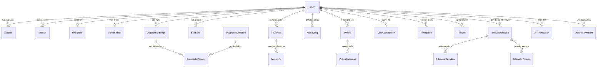

# Database Design & Relational Schema: AI Pather

> **Document Status**: Reconstructed from the implemented system.  
> **Target System**: AI Pather (Repository: `Ai-learning-roadmap/backend/prisma/schema.prisma`)  
> **Database Engine**: PostgreSQL 16 (Hosted on Neon Serverless / PostgreSQL)  
> **ORM**: Prisma 7.9.1 with `@prisma/adapter-pg`

---

## 1. Relational Entity Overview

The schema defines **28 relational models** organized into functional clusters:

---

## 2. Core Entity Definitions

### 1. Authentication & Identity (Better-Auth)
- **`user`**: Primary user identity storing `name`, `email` (unique), `emailVerified`, `role` (`"LEARNER"` or `"ADMIN"`), `plan` (`"FREE"`, `"PLUS"`, `"PRO"`), and `twoFactorEnabled`.
- **`account`**: Linked identity provider details (`providerId`, `accessToken`, `refreshToken`, `password`).
- **`session`**: Active authentication sessions (`token` [unique], `ipAddress`, `userAgent`, `expiresAt`).
- **`twoFactor`**: Two-factor authentication configuration (`secret`, `backupCodes`, `verified`, `failedVerificationCount`).
- **`verification`**: Generic token verification store (`identifier`, `value`, `expiresAt`).

### 2. Career Target & Profiling
- **`CareerProfile`**:
  - Maps one-to-one with `user` via `userId` (unique).
  - Attributes: `targetRole`, `targetRoleName`, `experienceLevel` (`BEGINNER` | `INTERMEDIATE`), `weeklyAvailableHours`, `onboardingCompleted`, `resumeScore`, `interviewScore`, `aiAnalysis` (JSON).

### 3. Diagnostic Assessment Bank & Attempts
- **`DiagnosticQuestion`**: Multi-dimensional question bank (`category`, `skill`, `options` [JSON], `correctAnswer`, `difficulty`, `order`, `isActive`). Indexed on `[category]`, `[skill]`, `[difficulty]`, `[order]`.
- **`DiagnosticAttempt`**: Records user diagnostic sessions (`status`, `totalQuestions`, `answeredQuestions`, `score`, `startedAt`, `completedAt`). Indexed on `[userId, status, completedAt(sort: Desc)]`.
- **`DiagnosticAnswer`**: Individual question responses (`selectedAnswer`, `isCorrect`, `evaluation` [JSON]). Unique compound constraint: `@@unique([attemptId, questionId])`.

### 4. Dynamic Curriculum & Skills
- **`SkillState`**: Primary ledger of learner competencies.
  - Fields: `userId`, `skillName`, `knowledgeScore`, `practiceScore`, `projectScore`, `evidenceScore`, `lastReviewed`.
  - Unique constraint: `@@unique([userId, skillName])`.
- **`Roadmap`**: User's active or archived roadmap instances (`userId`, `targetRole`, `status`). Indexed on `[userId, status, targetRole]`.
- **`Milestone`**: Individual steps within a roadmap (`roadmapId`, `order`, `title`, `description`, `status` [`UPCOMING`, `CURRENT`, `COMPLETED`], `estimatedTime`, `why`, `unlocks` [String[]]).

### 5. Projects & Evidence Verification
- **`Project`**:
  - Fields: `userId`, `title`, `description`, `repositoryUrl`, `liveUrl`, `projectType` (`GENERATED` | `IMPORTED`), `specification` (JSON), `aiSummary` (JSON), `plannedVsActual` (JSON), `techStack` (String[]), `score`, `isVerified`.
- **`ProjectEvidence`**: Join table mapping verified skills to project artifacts.
  - Fields: `projectId`, `userId`, `skillName`, `evidenceType` (`GITHUB` | `LIVE` | `MANUAL`), `url`.
  - Unique constraint: `@@unique([projectId, skillName])`.

### 6. Observability & Logging Tables
- **`AiUsageLog`**: Records every AI inference across all providers.
  - Fields: `provider`, `model`, `feature`, `status` (`SUCCESS` | `FAILURE`), `durationMs`, `tokensUsed`, `errorMessage`.
  - Indexes: `[provider]`, `[status]`, `[feature]`, `[createdAt]`.
- **`ErrorLog`**: Records unhandled server exceptions.
  - Fields: `errorType`, `message`, `endpoint`, `method`, `statusCode`, `userId`, `metadata` (stack trace JSON).
- **`AdminAuditLog`**: Tracks sensitive admin actions (`adminId`, `action`, `targetId`, `details` [JSON]).
- **`AnalyticsSnapshot`**: Daily aggregated platform metrics (`date` [unique], `totalUsers`, `totalRoadmaps`, `totalAssessments`, `totalProjects`, `careerReadyCount`).

### 7. Resume, ATS & Interviews
- **`Resume`**: Candidate resume storage (`targetRole`, `fullName`, `summary`, `skills` [JSON], `experience` [JSON], `projects` [JSON], `education` [JSON], `atsScore`, `atsFeedback` [JSON]).
- **`InterviewSession`**, **`InterviewQuestion`**, **`InterviewAnswer`**: Multi-turn mock interview transcripts and scoring evaluations.

---

## 3. Database Constraints & Indexing Strategy

1. **Cascade Deletions**:
   - `user` cascades deletions to `account`, `session`, `twoFactor`, `CareerProfile`, `diagnosticAttempts`, `interviewSessions`, `skillStates`, `roadmaps`, `projects`, and `adminAuditLogs`.
   - `Roadmap` cascades deletions to `Milestone`.
   - `Project` cascades deletions to `ProjectEvidence`.
2. **Compound Indexes for Query Optimization**:
   - `[userId, status, completedAt(sort: Desc)]` on `DiagnosticAttempt` enables rapid retrieval of the user's latest completed assessment.
   - `[userId, status, targetRole]` on `Roadmap` optimizes active roadmap resolution.
   - `[userId, createdAt(sort: Desc)]` on `ActivityLog` accelerates learner timeline rendering.
