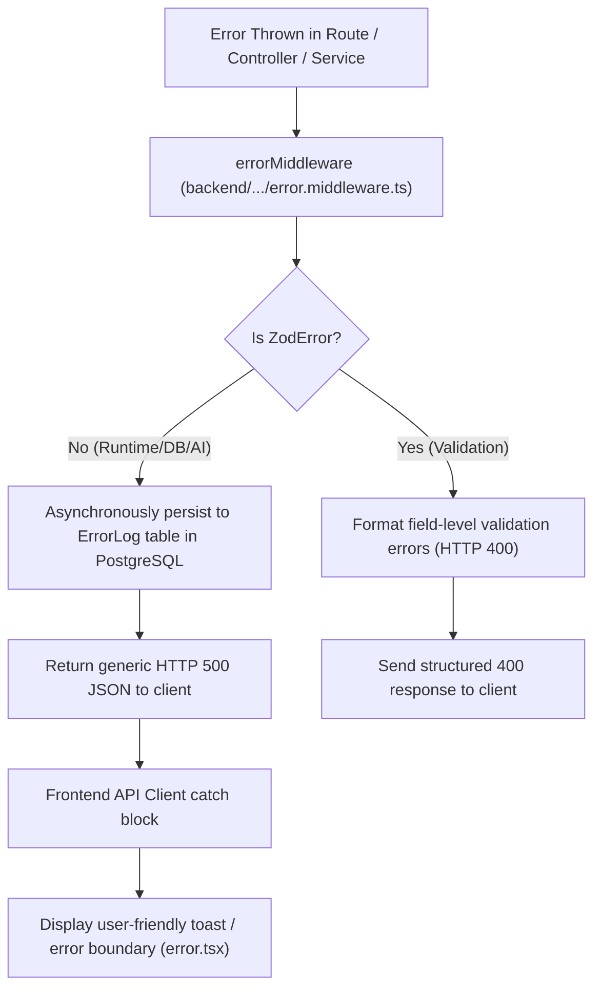

# Engineering: Error Handling & Resilience Architecture

> **Document Status**: Reconstructed from the implemented system.  
> **Target System**: AI Pather (Repository: `Ai-learning-roadmap`)  
> **Version Evaluated**: 1.0.0

---

## 1. Centralized Error Pipeline

Error management in AI Pather is centralized through dedicated Express middleware and client error boundaries:



---

## 2. Backend Error Middleware Implementation

The Express error pipeline is implemented in [`backend/src/middlewares/error.middleware.ts`](file:///c:/Coding-Projects/projects/Ai-learning-roadmap/backend/src/middlewares/error.middleware.ts):

### A. Validation Errors (`ZodError`)
- Catches input schema failures before reaching business logic.
- Maps field issues into structured errors returned with HTTP 400:
  ```json
  {
    "success": false,
    "message": "Invalid request data.",
    "errors": [
      { "field": "email", "message": "Invalid email address" }
    ]
  }
  ```

### B. Asynchronous Database Error Logging (`ErrorLog`)
- Captures `errorType`, `message`, `endpoint`, `method`, `statusCode`, and first 1000 characters of stack trace (`metadata: { stack }`).
- Executes fire-and-forget write via `prisma.errorLog.create` to prevent error-logging failures from disrupting the HTTP response cycle.

### C. Implementation Bug Observation in User Attribution
In `error.middleware.ts:L19`:
```typescript
const userId = (req as any).user?.id || (req as any).session?.userId || null;
```
However, `auth.middleware.ts:L35` and `L73` set `req.userId = data.user.id`. Because `error.middleware.ts` inspects `(req as any).user?.id` instead of `req.userId`, unhandled server errors record `userId: null` in the `ErrorLog` table even when triggered by authenticated users.

---

## 3. Frontend Error Resilience

1. **Next.js Global Error Boundaries**:
   - [`frontend/src/app/error.tsx`](file:///c:/Coding-Projects/projects/Ai-learning-roadmap/frontend/src/app/error.tsx): Global client-side boundary capturing unhandled React rendering crashes, offering a 1-click retry button without full page reload.
   - [`frontend/src/app/not-found.tsx`](file:///c:/Coding-Projects/projects/Ai-learning-roadmap/frontend/src/app/not-found.tsx): Branded 404 page for nonexistent routes.
2. **TanStack React Query Error States**:
   - Queries and mutations expose `isError` and `error` states, rendering contextual fallback cards and retry options directly within dashboard views.
