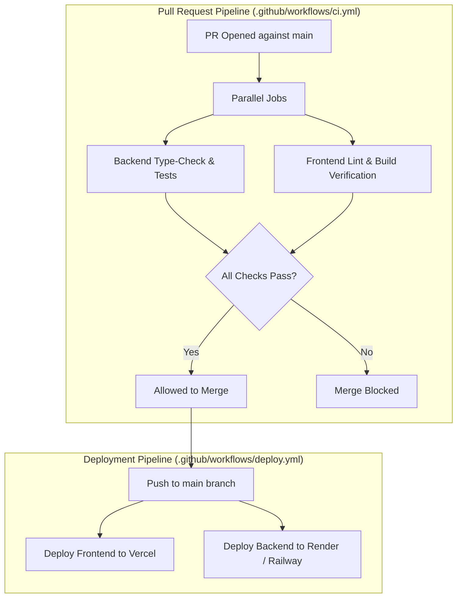

# Infrastructure: CI/CD Pipeline Analysis

> **Document Status**: Reconstructed from the implemented system.  
> **Target System**: AI Pather (Repository: `Ai-learning-roadmap`)  
> **Implementation Status**: **NOT IMPLEMENTED** in repository files.

---

## 1. Current State Evaluation

A thorough inspection of the repository confirms that **no automated CI/CD pipeline configurations exist**:
- No `.github/workflows/` directory.
- No GitLab CI (`.gitlab-ci.yml`), Bitbucket Pipelines, or CircleCI configurations.
- Quality assurance checks (TypeScript compilation, ESLint, and unit tests) must currently be run manually by engineers prior to pushing code:
  - `npm --prefix backend run type-check`
  - `npm --prefix backend test`
  - `npm --prefix frontend run lint`
  - `npm --prefix frontend run build`

---

## 2. Production CI/CD Blueprint (Recommended)

To achieve enterprise software delivery standards, the repository should implement a two-stage GitHub Actions pipeline:



### Proposed GitHub Actions Workflow Specification (`.github/workflows/ci.yml`):
```yaml
name: Continuous Integration

on:
  pull_request:
    branches: [main]
  push:
    branches: [main]

jobs:
  backend-test:
    name: Backend Lint, Type-Check & Tests
    runs-on: ubuntu-latest
    steps:
      - uses: actions/checkout@v4
      - uses: actions/setup-node@v4
        with:
          node-version: 22
          cache: "npm"
          cache-dependency-path: backend/package-lock.json
      - run: cd backend && npm ci
      - run: cd backend && npx prisma generate
      - run: cd backend && npm run type-check
      - run: cd backend && npm test

  frontend-build:
    name: Frontend Lint & Build Check
    runs-on: ubuntu-latest
    steps:
      - uses: actions/checkout@v4
      - uses: actions/setup-node@v4
        with:
          node-version: 22
          cache: "npm"
          cache-dependency-path: frontend/package-lock.json
      - run: cd frontend && npm ci
      - run: cd frontend && npm run lint
      - run: cd frontend && npm run build
        env:
          NEXT_PUBLIC_APP_URL: "http://localhost:3000"
          NEXT_PUBLIC_API_URL: "http://localhost:5000"
          BETTER_AUTH_URL: "http://localhost:5000"
```
