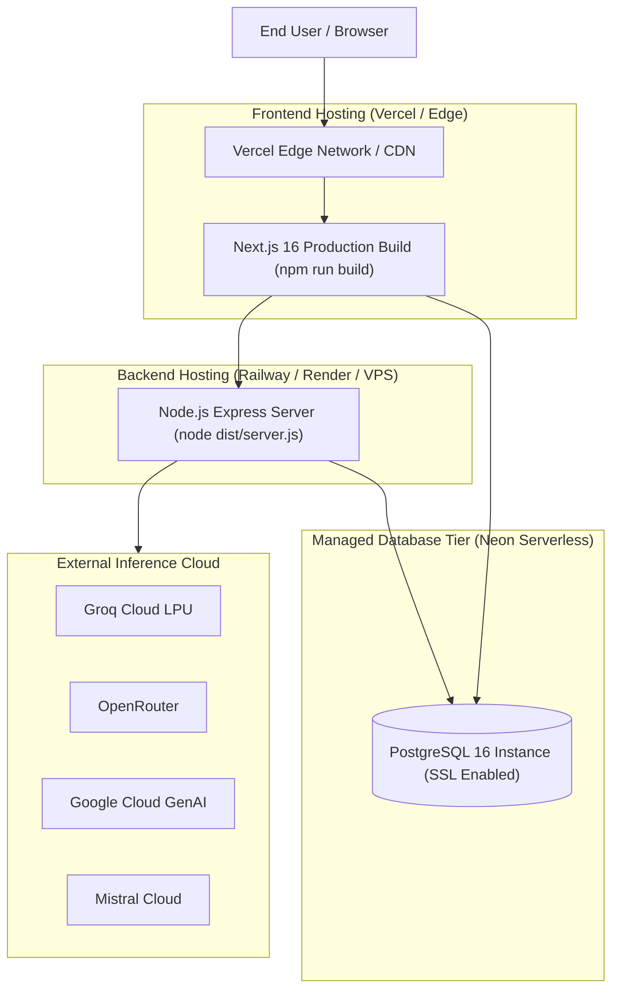

# Infrastructure: Deployment Architecture & Guide

> **Document Status**: Reconstructed from the implemented system.  
> **Target System**: AI Pather (Repository: `Ai-learning-roadmap`)  
> **Version Evaluated**: 1.0.0

---

## 1. Production Deployment Topology

AI Pather is designed for a split cloud deployment:

---

## 2. Frontend Deployment (Vercel)

1. **Preset**: Next.js App Router preset.
2. **Root Directory**: `frontend`
3. **Build Command**: `next build`
4. **Environment Variables Required**:
   - `NEXT_PUBLIC_APP_URL`: Production domain (e.g. `https://aipather.com`)
   - `NEXT_PUBLIC_API_URL`: Backend API URL (e.g. `https://api.aipather.com`)
   - `BETTER_AUTH_URL`: Canonical auth URL (e.g. `https://aipather.com` or backend domain)
   - `DATABASE_URL`: PostgreSQL connection string (for Better-Auth direct pool)
   - `STRIPE_SECRET_KEY` & `STRIPE_WEBHOOK_SECRET`

---

## 3. Backend Deployment (Render / Railway / VPS)

1. **Runtime**: Node.js v20.x or v22.x LTS.
2. **Root Directory**: `backend`
3. **Build Command**: `npm install && npx prisma generate && npm run build`
4. **Start Command**: `node dist/server.js`
5. **Environment Variables Required**:
   - `PORT`: Server port (e.g. `5000`)
   - `NODE_ENV`: `production`
   - `CORS_ORIGIN`: Allowed frontend origin (e.g. `https://aipather.com`)
   - `FRONTEND_URL`: Internal URL to reach frontend auth endpoint (e.g. `https://aipather.com`)
   - `DATABASE_URL`: Cloud PostgreSQL connection string
   - `GROQ_API_KEY` (and optional secondary/tertiary keys)
   - `OPENROUTER_API_KEY`, `GEMINI_API_KEY`, `MISTRAL_API_KEY`

---

## 4. Current Deployment Gaps

- **Containerization**: **NOT IMPLEMENTED** (No `Dockerfile` or `docker-compose.yml` exists in the repository). Deployments rely on native host Node.js runtimes.
- **Infrastructure as Code (IaC)**: **NOT IMPLEMENTED** (No Terraform, Pulumi, or AWS CDK configurations exist). Infrastructure provisioning is completely manual.
- **Health Check Path**: Backend exposes `/health` ([app.ts:L129-L134](file:///c:/Coding-Projects/projects/Ai-learning-roadmap/backend/src/app.ts#L129-L134)), suitable for load balancer health probes.
