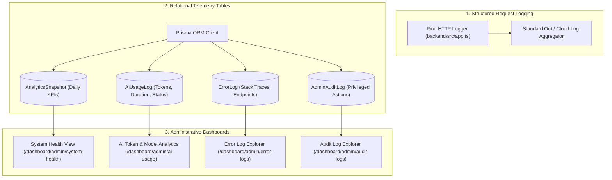

# Infrastructure: Observability & Monitoring Architecture

> **Document Status**: Reconstructed from the implemented system.  
> **Target System**: AI Pather (Repository: `Ai-learning-roadmap`)  
> **Version Evaluated**: 1.0.0

---

## 1. Observability Architecture Overview

AI Pather implements a three-tier observability model:

---

## 2. Telemetry Schema & Persistence

### 1. AI Inference Logging (`AiUsageLog`)
Every call through `ChatService` logs:
- `provider`: String (e.g. `Groq`, `Groq-2`, `OpenRouter`, `Gemini`, `Mistral`)
- `model`: String (e.g. `qwen/qwen3.8-27b`)
- `feature`: Invoking domain feature (`CHAT`, `DIAGNOSTIC`, `ROADMAP`, `SIMULATION`)
- `status`: `SUCCESS` or `FAILURE`
- `durationMs`: Execution duration in milliseconds
- `tokensUsed`: Total token consumption reported by the provider
- `errorMessage`: Captured exception message when failed

### 2. Unhandled Exception Auditing (`ErrorLog`)
The central Express error middleware records unhandled runtime exceptions:
- `errorType`: Exception class or name
- `message`: Error string
- `endpoint`: HTTP request path (`req.originalUrl`)
- `method`: HTTP verb (`GET`, `POST`, etc.)
- `statusCode`: HTTP status code (400, 500)
- `metadata`: Truncated stack trace (first 1000 characters)

---

## 3. Production Monitoring Gaps

While the internal administrative logging tables provide good domain visibility:
1. **No External APM / OpenTelemetry**:
   - The application does not integrate Datadog, New Relic, Sentry, or OpenTelemetry for distributed tracing.
2. **Missing Real-Time Alerting**:
   - When AI providers fail or database pool errors spike, there is no automated Slack, PagerDuty, or email alerting mechanism configured.
3. **Database Telemetry Growth**:
   - `AiUsageLog`, `ErrorLog`, and `ActivityLog` grow monotonically without automated table partitioning, TTL indexes, or archiving cron jobs.
