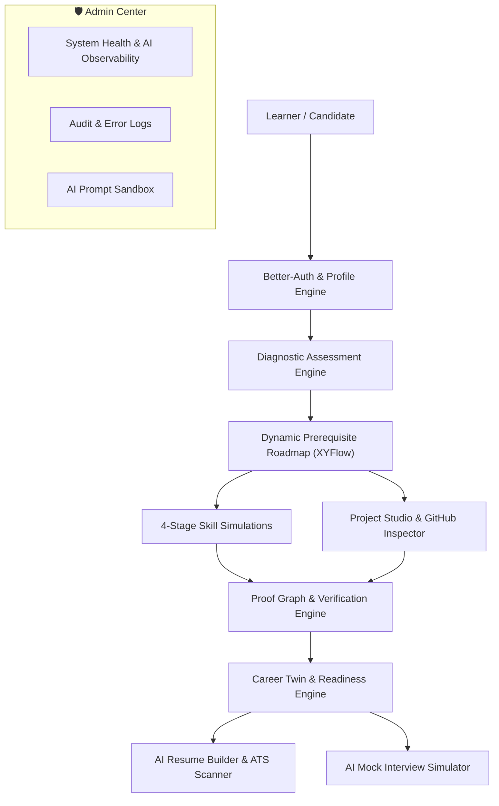

# Product Requirements Document (PRD): AI Pather

> **Document Status**: Reconstructed from the implemented system.  
> **Target System**: AI Pather (Repository: `Ai-learning-roadmap`)  
> **Authors**: Product & Engineering Architecture  
> **Status**: Living Engineering Reference

---

## 1. Executive Summary

AI Pather is an adaptive technical career navigation and skill verification platform designed to guide software developers from foundational learning to verified market readiness. It replaces static curriculum checklists with dynamic prerequisite dependency graphs, authentic 4-stage coding and debugging simulations, verified GitHub project evidence extraction, and ATS-optimized resume analysis.

---

## 2. Core Functional Modules & Scope

The platform codebase is structured into modular feature sets mapped across frontend and backend domains:

### Module 1: Diagnostic Assessment Engine
- **Purpose**: Establishes initial baseline skills and identifies missing prerequisites upon onboarding.
- **Components**: Question bank loader, multi-category evaluation (MCQ, code, communication), scoring algorithm.
- **Code Locations**:
  - Backend: [`backend/src/modules/learner/diagnostic/`](file:///c:/Coding-Projects/projects/Ai-learning-roadmap/backend/src/modules/learner/diagnostic/)
  - Frontend: [`frontend/src/app/diagnostic/`](file:///c:/Coding-Projects/projects/Ai-learning-roadmap/frontend/src/app/diagnostic/)

### Module 2: Interactive Dynamic Roadmap (XYFlow Canvas)
- **Purpose**: Visualizes career milestones as interactive nodes in a Directed Acyclic Graph (DAG) with dependency unlocking mechanics.
- **Components**: Node drawer, prerequisite tracker, roadmap milestone updater.
- **Code Locations**:
  - Backend: [`backend/src/modules/learner/roadmap/`](file:///c:/Coding-Projects/projects/Ai-learning-roadmap/backend/src/modules/learner/roadmap/)
  - Frontend: [`frontend/src/components/dashboard/learner/learning-path/RoadmapGraph/`](file:///c:/Coding-Projects/projects/Ai-learning-roadmap/frontend/src/components/dashboard/learner/learning-path/RoadmapGraph/)

### Module 3: Authentic 4-Stage Simulations
- **Purpose**: Evaluates candidate competencies through realistic software engineering workflows.
- **Stages**:
  1. *Understand*: Theoretical MCQ on edge cases and performance.
  2. *Debug*: Identifies root causes of realistic code bugs.
  3. *Code*: Hands-on programming validated via pattern matching.
  4. *Explain*: Technical communication graded on trade-off articulation.
- **Code Locations**:
  - Backend: [`backend/src/modules/learner/assessments/services/skill-simulation.service.ts`](file:///c:/Coding-Projects/projects/Ai-learning-roadmap/backend/src/modules/learner/assessments/services/skill-simulation.service.ts)
  - Frontend: [`frontend/src/app/(dashboard)/dashboard/(learner)/learner/assessments/`](file:///c:/Coding-Projects/projects/Ai-learning-roadmap/frontend/src/app/(dashboard)/dashboard/(learner)/learner/assessments/)

### Module 4: Project Studio & Public Proof Graph
- **Purpose**: Validates project work by generating full architectural build specs or inspecting real GitHub repositories, publishing verifiable public proof tokens.
- **Code Locations**:
  - Backend: [`backend/src/modules/learner/projects/`](file:///c:/Coding-Projects/projects/Ai-learning-roadmap/backend/src/modules/learner/projects/), [`backend/src/modules/learner/proof-graph/`](file:///c:/Coding-Projects/projects/Ai-learning-roadmap/backend/src/modules/learner/proof-graph/)
  - Public Proof Route: [`frontend/src/app/verify/`](file:///c:/Coding-Projects/projects/Ai-learning-roadmap/frontend/src/app/verify/)

### Module 5: Resilient AI Copilot & Gateway
- **Purpose**: Provides contextual guidance using learner telemetry with multi-account, multi-provider failover.
- **Code Locations**:
  - Backend: [`backend/src/modules/learner/copilot/`](file:///c:/Coding-Projects/projects/Ai-learning-roadmap/backend/src/modules/learner/copilot/)
  - Frontend: [`frontend/src/components/chat/HomeFloatingChat.tsx`](file:///c:/Coding-Projects/projects/Ai-learning-roadmap/frontend/src/components/chat/HomeFloatingChat.tsx)

### Module 6: Career Intelligence, Resume & Mock Interview
- **Purpose**: Analyzes job market expectations, matches resume keywords via ATS scanning, and simulates technical interviews.
- **Code Locations**:
  - Backend: [`backend/src/modules/learner/resume/`](file:///c:/Coding-Projects/projects/Ai-learning-roadmap/backend/src/modules/learner/resume/), [`backend/src/modules/learner/interview/`](file:///c:/Coding-Projects/projects/Ai-learning-roadmap/backend/src/modules/learner/interview/), [`backend/src/modules/learner/job-reality/`](file:///c:/Coding-Projects/projects/Ai-learning-roadmap/backend/src/modules/learner/job-reality/)

---

## 3. Implementation Status Summary

| Capability | Codebase Status | Evidence |
| :--- | :--- | :--- |
| Email / OAuth / 2FA Auth | **IMPLEMENTED** | `frontend/src/lib/auth.ts`, `backend/src/middlewares/auth.middleware.ts` |
| Dynamic XYFlow Roadmap Canvas | **IMPLEMENTED** | `@xyflow/react` in `frontend/.../RoadmapGraphCanvas.tsx` |
| 4-Stage Skill Simulations | **IMPLEMENTED** | `backend/.../skill-simulation.service.ts` |
| Deterministic AI Fallback | **IMPLEMENTED** | `generateFallbackSimulation` in `skill-simulation.service.ts` |
| GitHub Repository Inspector | **IMPLEMENTED** | `backend/.../github-inspector.service.ts` |
| Public Proof Graph Tokens | **IMPLEMENTED** | `backend/.../proof-graph.service.ts` |
| ATS Resume Builder & PDF Export | **IMPLEMENTED** | `@react-pdf/renderer` in `frontend/.../resume/` |
| 4-Tier Multi-Account AI Gateway | **IMPLEMENTED** | `chat.service.ts` (Groq, OpenRouter, Gemini, Mistral) |
| Automated Frontend Testing | **NOT IMPLEMENTED** | Zero `*.test.tsx` files present in `frontend/` |
| Automated CI/CD Pipelines | **NOT IMPLEMENTED** | No `.github/workflows/` directory in repository |
| Containerization (Docker) | **NOT IMPLEMENTED** | No Dockerfile or docker-compose in codebase |
