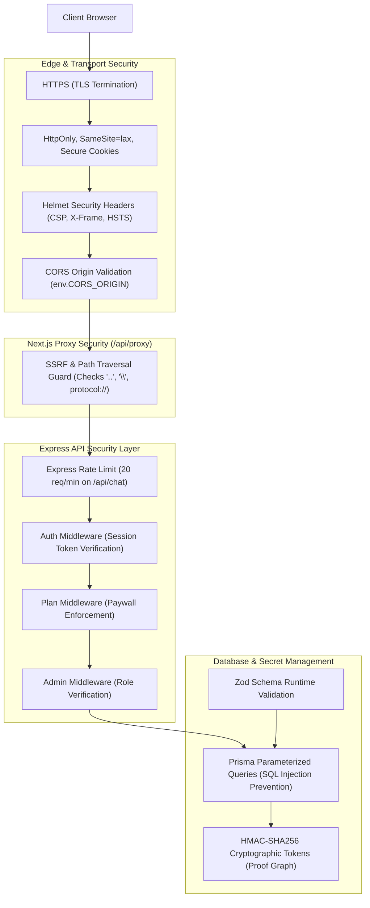

# Security Architecture: AI Pather

> **Document Status**: Reconstructed from the implemented system.  
> **Target System**: AI Pather (Repository: `Ai-learning-roadmap`)  
> **Version Evaluated**: 1.0.0

---

## 1. Security Architecture Overview

AI Pather implements defense-in-depth across the application boundary, API proxy layer, Express backend, and persistence tier:



---

## 2. Core Security Controls

### 1. HTTP Security Headers & CORS
- **Helmet**: [`backend/src/app.ts:L36`](file:///c:/Coding-Projects/projects/Ai-learning-roadmap/backend/src/app.ts#L36) mounts `helmet()` configuring standard security headers (Content-Security-Policy, X-Content-Type-Options, Strict-Transport-Security, X-Frame-Options).
- **CORS**: [`backend/src/app.ts:L40-L44`](file:///c:/Coding-Projects/projects/Ai-learning-roadmap/backend/src/app.ts#L40-L44) restricts origins to `env.CORS_ORIGIN` (`http://localhost:3000` in development) with `credentials: true`.

### 2. Next.js Proxy Traversal & SSRF Prevention
[`frontend/src/app/api/proxy/[...path]/route.ts:L12-L23`](file:///c:/Coding-Projects/projects/Ai-learning-roadmap/frontend/src/app/api/proxy/[...path]/route.ts#L12-L23) enforces:
```typescript
if (
  !subPath ||
  subPath.includes("..") ||
  subPath.includes("\\") ||
  /^[a-zA-Z]+:\/\//.test(subPath)
) {
  return NextResponse.json({ success: false, message: "Invalid request path" }, { status: 400 });
}
```
Prevents directory traversal attacks and SSRF attempts redirecting traffic to arbitrary external protocols.

### 3. Session Security
- Managed by Better-Auth: Tokens are stored in the `session` table and written to cookies with `httpOnly: true`, `sameSite: "lax"`, and `secure: true` in production deployments ([auth.ts:L517-L525](file:///c:/Coding-Projects/projects/Ai-learning-roadmap/frontend/src/lib/auth.ts#L517-L525)).

### 4. Cryptographic Proof Graph Tokens
[`backend/src/modules/learner/proof-graph/services/proof-graph.service.ts:L275-L294`](file:///c:/Coding-Projects/projects/Ai-learning-roadmap/backend/src/modules/learner/proof-graph/services/proof-graph.service.ts#L275-L294):
- Generates HMAC-SHA256 signatures over base64url payloads (`{ u: userId, t: Date.now() }`).
- Validates signatures using timing-safe comparison (`crypto.timingSafeEqual`) to prevent timing attacks.

### 5. Input Validation & SQL Injection Prevention
- All database queries run through Prisma ORM using parameterized queries, preventing SQL injection.
- AI inputs and simulation submissions are validated using strict Zod schemas.

---

## 3. Security Boundaries & Trust Zones

1. **Client / Browser (Untrusted)**: Client-side storage and user inputs are strictly untrusted.
2. **Next.js Server (Semi-Trusted)**: Acts as the authentication authority and proxy gateway.
3. **Express API Server (Trusted Internal)**: Executes business logic and communicates with the database.
4. **PostgreSQL Database (Secure Storage)**: Stores user records, passwords (bcrypt-hashed via Better-Auth), and business data.
5. **External AI APIs (External Boundary)**: Outbound requests pass sanitized prompts and ingest filtered JSON outputs.
